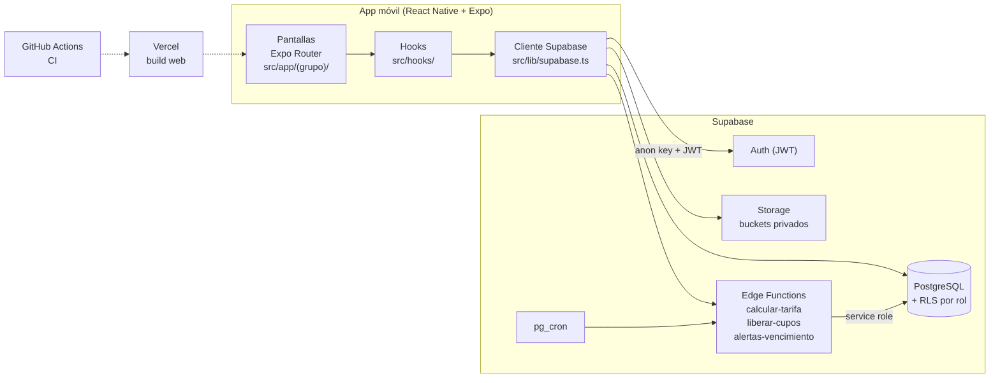
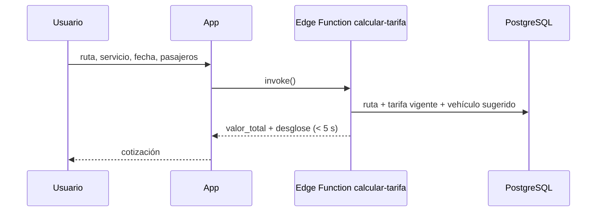

# Arquitectura — GOLDTRANS App

## Vista general

## Capas

| Capa | Ubicación | Responsabilidad |
|---|---|---|
| Rutas / pantallas | `src/app/` | Una pantalla por archivo. Grupos por rol: `(auth)`, `(public)`, `(client)`, `(advisor)`, `(admin)`. Cada `_layout.tsx` protege el grupo según el rol de la sesión. |
| Componentes | `src/components/` | UI reutilizable, sin acceso directo a datos. |
| Hooks | `src/hooks/` | Lógica de datos y estado (`use-*.ts`). Único punto que llama a `lib/`. |
| Servicios | `src/lib/` | Cliente Supabase y funciones de acceso a datos. |
| Tipos | `src/types/` | `database.ts` generado desde Supabase + tipos de dominio. |
| Base de datos | `supabase/migrations/` | Esquema versionado (SQL). Una migración por cambio. |
| Lógica de servidor | `supabase/functions/` | Edge Functions (Deno) para cálculos y tareas programadas. |

## Módulos y roles

| Módulo | Visitante | Cliente | Asesor | Admin |
|---|:-:|:-:|:-:|:-:|
| Cotizador instantáneo | ✔ | ✔ | ✔ | ✔ |
| Solicitudes formales | | ✔ (propias) | ✔ (gestiona) | ✔ |
| Goldtours — catálogo | ✔ | ✔ | ✔ | ✔ |
| Goldtours — reservas y abonos | | ✔ (propias) | ✔ (verifica) | ✔ |
| Repositorio documental / licitaciones | | | ✔ | ✔ |
| Usuarios, rutas, tarifas, flota, paquetes | | | | ✔ |

## Seguridad

- La app solo conoce la **anon key**; los permisos reales los imponen las políticas **RLS** según el rol del JWT.
- La **service role key** solo existe en Edge Functions / CI, nunca en el bundle de la app.
- La sesión se persiste en `AsyncStorage` y el token se refresca solo con la app en primer plano.
- Archivos (comprobantes, documentos) en buckets **privados**, accedidos con URLs firmadas.

## Flujo de cotización (Sprint 2)

## Entornos

| Entorno | App | Supabase |
|---|---|---|
| Local | `npx expo start` / `docker compose up app` | `npx supabase start` (Docker) |
| CI | GitHub Actions (lint, tipos, tests, bundle, Docker) | — |
| Producción | EAS Build (Android/iOS) + Vercel (web) | Proyecto Supabase cloud |
